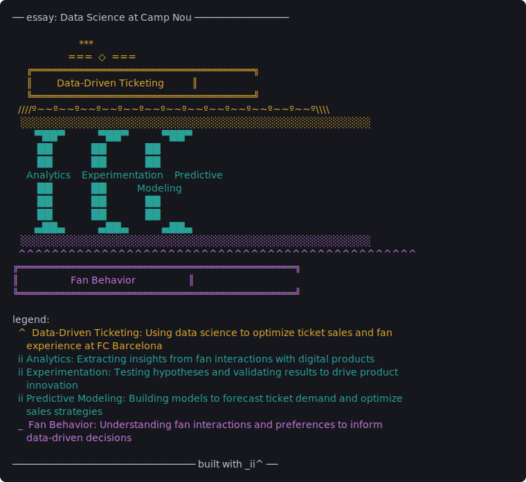

</div>

<p align="center">

</p>

<p align="center">
  <strong>Render any input as a portico: a three-layered abstraction.</strong>
</p>

<p align="center">
  <a href="https://pypi.org/project/portico-cli/"></a>
  <a href="https://pypi.org/project/portico-cli/"></a>
  <a href="https://huggingface.co/spaces/0trm/portico"></a>
</p>

---

## Try it online

Run `portico` in your browser on Hugging Face Spaces -- no install required:

**[huggingface.co/spaces/0trm/portico](https://huggingface.co/spaces/0trm/portico)**

The Space uses Llama 3.3 70B via Groq. Paste text or a URL and render.

## Install

```bash
uv tool install portico-cli
```

## Try it locally

```bash
portico README.md
portico https://example.com/article
portico ./src --no-legend
echo "your text here" | portico -
```

## What is a portico

An LLM reads your input, decides what kind of thing it is, and decomposes it into three layers. The renderer turns those layers into a fixed ASCII shape that resembles [a portico](docs/structure.jpg).

|  Glyph  | Layer   | Meaning                                       |
| :-----: | ------- | --------------------------------------------- |
|   `^`   | Roof    | The unifying idea                             |
|  `ii`   | Pillars | The load-bearing components (2-9 of them)     |
|   `_`   | Base    | The foundation everything rests on            |

## Example

```bash
portico https://trm.bearblog.dev/data-science-at-camp-nou/
```

```
── essay: Data Science at Camp Nou ─────────────────

                        ***
                    ===  ◇  ===
     ╔════════════════════════════════════════╗
     ║         Data-Driven Ticketing          ║
     ╚════════════════════════════════════════╝
  ////º~~º~~º~~º~~º~~º~~º~~º~~º~~º~~º~~º~~º~\\\\
   ░░░░░░░░░░░░░░░░░░░░░░░░░░░░░░░░░░░░░░░░░░░░░░
        ▀██▀            ▀██▀            ▀██▀
         ██              ██              ██
         ██              ██              ██
     Analytics    Experimentation    Predictive
         ██              ██           Modeling
         ██              ██              ██
         ██              ██              ██
        ▄██▄            ▄██▄            ▄██▄
   ░░░░░░░░░░░░░░░░░░░░░░░░░░░░░░░░░░░░░░░░░░░░░░
  ^^^^^^^^^^^^^^^^^^^^^^^^^^^^^^^^^^^^^^^^^^^^^^^^
╔══════════════════════════════════════════════════╗
║                   Fan Behavior                   ║
╚══════════════════════════════════════════════════╝

legend:
  ^  Data-Driven Ticketing: Using data science to optimize ticket sales and fan
     experience at FC Barcelona
  ii Analytics: Extracting insights from fan interactions with digital products
     to inform strategic decisions
  ii Experimentation: Testing hypotheses and validating results to drive product
     innovation
  ii Predictive Modeling: Building models to forecast ticket demand and optimize
     sales strategies
  _  Fan Behavior: Understanding fan interactions and preferences to inform
     data-driven decisions

───────────────────────────────── built with _ii^ ──
```

Rendered with `llama-3.3-70b-versatile`.

## Inputs

- Raw text or stdin
- Local files and directories
- URLs (page content is extracted)
- Git repositories

When an input doesn't fit a three-layer shape – poems, flat lists, gibberish – `portico` refuses honestly rather than fake one.

## Customization

| Flag                            | What it does                                                            |
| ------------------------------- | ----------------------------------------------------------------------- |
| `--no-legend`                   | Hide the per-layer summary (legend renders by default)                  |
| `--color {auto,always,never}`   | Colorize roof / pillars / base. default: `never`                        |
| `--reapex[=N]`                  | Roll a random apex ornament; pin seed `N` to reproduce                  |
| `--json`                        | Emit the analyzer's JSON instead of rendering                           |
| `--diagnose`                    | Print a pipeline report (input type, model, fit quality) and exit       |

Run `portico --help` for the full list.

### Colors

`--color=always` paints each layer a different accent: roof yellow, pillars cyan, base magenta. `--color=auto` (default `never`) only colors when stdout is a TTY and `NO_COLOR` is unset.

```bash
portico https://trm.bearblog.dev/data-science-at-camp-nou/ --color=always
```

<p align="center">
  
</p>

### Random apex

`--reapex` rolls a different ornament above the title each run. Pin the seed to reproduce the exact composition.

```bash
portico https://trm.bearblog.dev/data-science-at-camp-nou/ --reapex=0
```

```
── essay: Data Science at Camp Nou ─────────────────

                       ▲ * ▲
                    ~~~  ▲  ~~~
     ╔════════════════════════════════════════╗
     ║         Data-Driven Ticketing          ║
     ╚════════════════════════════════════════╝
  ////º~~º~~º~~º~~º~~º~~º~~º~~º~~º~~º~~º~~º~\\\\
   ░░░░░░░░░░░░░░░░░░░░░░░░░░░░░░░░░░░░░░░░░░░░░░
        ▀██▀            ▀██▀            ▀██▀
         ██              ██              ██
         ██              ██              ██
     Analytics    Experimentation    Predictive
         ██              ██           Modeling
         ██              ██              ██
         ██              ██              ██
        ▄██▄            ▄██▄            ▄██▄
   ░░░░░░░░░░░░░░░░░░░░░░░░░░░░░░░░░░░░░░░░░░░░░░
  ^^^^^^^^^^^^^^^^^^^^^^^^^^^^^^^^^^^^^^^^^^^^^^^^
╔══════════════════════════════════════════════════╗
║                   Fan Behavior                   ║
╚══════════════════════════════════════════════════╝
```

```bash
portico https://trm.bearblog.dev/data-science-at-camp-nou/ --reapex=1
```

```
── essay: Data Science at Camp Nou ─────────────────

                        ◆ ◆
                    ═══  ◆  ═══
     ╔════════════════════════════════════════╗
     ║         Data-Driven Ticketing          ║
     ╚════════════════════════════════════════╝
  ////º~~º~~º~~º~~º~~º~~º~~º~~º~~º~~º~~º~~º~\\\\
   ░░░░░░░░░░░░░░░░░░░░░░░░░░░░░░░░░░░░░░░░░░░░░░
        ▀██▀            ▀██▀            ▀██▀
         ██              ██              ██
         ██              ██              ██
     Analytics    Experimentation    Predictive
         ██              ██           Modeling
         ██              ██              ██
         ██              ██              ██
        ▄██▄            ▄██▄            ▄██▄
   ░░░░░░░░░░░░░░░░░░░░░░░░░░░░░░░░░░░░░░░░░░░░░░
  ^^^^^^^^^^^^^^^^^^^^^^^^^^^^^^^^^^^^^^^^^^^^^^^^
╔══════════════════════════════════════════════════╗
║                   Fan Behavior                   ║
╚══════════════════════════════════════════════════╝
```

```bash
portico https://trm.bearblog.dev/data-science-at-camp-nou/ --reapex=7
```

```
── essay: Data Science at Camp Nou ─────────────────

                       · · ·
                    ░░░  ▲  ░░░
     ╔════════════════════════════════════════╗
     ║         Data-Driven Ticketing          ║
     ╚════════════════════════════════════════╝
  ////º~~º~~º~~º~~º~~º~~º~~º~~º~~º~~º~~º~~º~\\\\
   ░░░░░░░░░░░░░░░░░░░░░░░░░░░░░░░░░░░░░░░░░░░░░░
        ▀██▀            ▀██▀            ▀██▀
         ██              ██              ██
         ██              ██              ██
     Analytics    Experimentation    Predictive
         ██              ██           Modeling
         ██              ██              ██
         ██              ██              ██
        ▄██▄            ▄██▄            ▄██▄
   ░░░░░░░░░░░░░░░░░░░░░░░░░░░░░░░░░░░░░░░░░░░░░░
  ^^^^^^^^^^^^^^^^^^^^^^^^^^^^^^^^^^^^^^^^^^^^^^^^
╔══════════════════════════════════════════════════╗
║                   Fan Behavior                   ║
╚══════════════════════════════════════════════════╝
```

Legends omitted -- the body and footer stay identical; only the 2-row apex varies.
