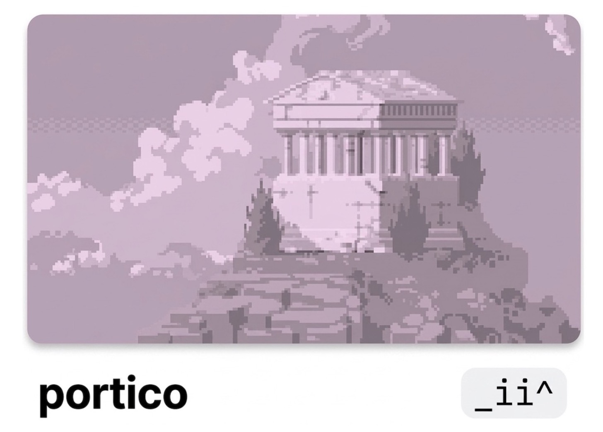

</div>

<p align="center">

</p>

<p align="center">
  <a href="https://pypi.org/project/portico-cli/"></a>
  <a href="https://pypi.org/project/portico-cli/"></a>
  <a href="https://huggingface.co/spaces/0trm/portico"></a>
</p>

<p align="center">
  <a href="#try-it-online">Try it online</a> •
  <a href="#try-it-locally">Try it locally</a> •
  <a href="#example">Example</a> •
  <a href="#inputs">Inputs</a> •
  <a href="#customization">Customization</a>
</p>

---

## About

**`portico` renders input as a three-layered visual abstraction.**

1. An LLM reads your input, classifies it, and decomposes it into three layers `_ii^`: roof, pillars, base. <br>
2. The renderer turns those layers into a fixed ASCII in the shape of [a portico](https://github.com/0trm/portico/blob/main/docs/structure.jpg). <br>
3. It builds a tiny monument for the thing you're trying to understand.

|  Glyph  | Layer   | Meaning                                       |
| :-----: | ------- | --------------------------------------------- |
|   `^`   | Roof    | The unifying idea                             |
|  `ii`   | Pillars | The load-bearing components                   |
|   `_`   | Base    | The foundation everything rests on            |

## Try it locally

### Install

```bash
uv tool install portico-cli
```

```bash
portico README.md
portico https://example.com/article
portico ./src --no-legend
echo "your text here" | portico -
```
## Try it online

Run `portico` in your browser, no install required:

**[▶ Try demo on Hugging Face](https://huggingface.co/spaces/0trm/portico)**

*The space uses 🦙 Llama 3.3 70B via Groq. Paste [input](#inputs) and render.*

## Example

```bash
portico "https://en.wikipedia.org/wiki/Transformer_(deep_learning_architecture)"
```
```
── encyclopedia article: Transformer ─────────────────────────────────────

                                   ◆ ◆
                               ^^^  ▲  ^^^
     ╔══════════════════════════════════════════════════════════════╗
     ║                  Attention Is All You Need                   ║
     ╚══════════════════════════════════════════════════════════════╝
  ////º~~º~~º~~º~~º~~º~~º~~º~~º~~º~~º~~º~~º~~º~~º~~º~~º~~º~~º~~º~~º~\\\\
   ░░░░░░░░░░░░░░░░░░░░░░░░░░░░░░░░░░░░░░░░░░░░░░░░░░░░░░░░░░░░░░░░░░░░
       ▀██▀          ▀██▀          ▀██▀          ▀██▀          ▀██▀
        ██            ██            ██            ██            ██
        ██            ██            ██            ██            ██
      RNN to         Core        Training    Variants and     Broad
   Transformer   Architecture    Paradigm     Efficiency   Applications
        ██            ██            ██            ██            ██
        ██            ██            ██            ██            ██
       ▄██▄          ▄██▄          ▄██▄          ▄██▄          ▄██▄
   ░░░░░░░░░░░░░░░░░░░░░░░░░░░░░░░░░░░░░░░░░░░░░░░░░░░░░░░░░░░░░░░░░░░░
  ^^^^^^^^^^^^^^^^^^^^^^^^^^^^^^^^^^^^^^^^^^^^^^^^^^^^^^^^^^^^^^^^^^^^^^
╔════════════════════════════════════════════════════════════════════════╗
║                          Multi-head Attention                          ║
╚════════════════════════════════════════════════════════════════════════╝

legend:
  ^  Attention Is All You Need: Replacing recurrence with multi-head self-
     attention enables parallel, scalable sequence modelling.
  ii RNN to Transformer: Sequential limitations of RNNs and seq2seq models
     motivated the shift to parallel attention.
  ii Core Architecture: Tokenization, positional encoding, encoder and decoder
     layers form the transformer's structure.
  ii Training Paradigm: Large-scale self-supervised pretraining followed by
     task-specific fine-tuning drives performance.
  ii Variants and Efficiency: Encoder-only, decoder-only, and encoder-decoder
     designs, plus optimizations like FlashAttention and KV caching, adapt the
     architecture to diverse needs.
  ii Broad Applications: Transformers have expanded from NLP to vision, audio,
     robotics, and multimodal generation.
  _  Multi-head Attention: Scaled dot-product multi-head attention is the
     mathematical substrate every transformer component rests on.

─────────────────────────────────────────────────────── built with _ii^ ──
```
*Run with `claude-sonnet-4-6`.*

## Inputs

- Raw text or stdin
- Local files and directories
- URLs (page content is extracted)
- Git repositories

When an input doesn't fit a three-layer shape – poems, flat lists, gibberish – `portico` refuses honestly rather than fake one.

## Customization

| Flag                            | What it does                                                            |
| ------------------------------- | ----------------------------------------------------------------------- |
| `--no-legend`                   | Hide the per-layer summary (legend renders by default)                  |
| `--reapex=N`                    | Pin the apex to seed `N` (random by default; pool of 600+ variants)     |
| `--json`                        | Emit the analyzer's JSON instead of rendering                           |
| `--diagnose`                    | Print a pipeline report (input type, model, fit quality) and exit       |

Run `portico --help` for the full list.

### Apex

The apex is the ornament crowning the portico -- picked at render time from a pool of 600+ variants. <br>
🎲 `--reapex=SEED` pins a specific composition to reproduce.

```bash
portico https://0trm.blog/data-science-at-camp-nou/ --reapex=0
```

```
── essay: Data Science at Camp Nou ─────────────────

                       ▲ * ▲
                    ~~~  ▲  ~~~
     ╔════════════════════════════════════════╗
     ║         Data-Driven Ticketing          ║
     ╚════════════════════════════════════════╝
  ////º~~º~~º~~º~~º~~º~~º~~º~~º~~º~~º~~º~~º~\\\\
   ░░░░░░░░░░░░░░░░░░░░░░░░░░░░░░░░░░░░░░░░░░░░░░
        ▀██▀            ▀██▀            ▀██▀
         ██              ██              ██
         ██              ██              ██
     Analytics    Experimentation    Predictive
         ██              ██           Modeling
         ██              ██              ██
         ██              ██              ██
        ▄██▄            ▄██▄            ▄██▄
   ░░░░░░░░░░░░░░░░░░░░░░░░░░░░░░░░░░░░░░░░░░░░░░
  ^^^^^^^^^^^^^^^^^^^^^^^^^^^^^^^^^^^^^^^^^^^^^^^^
╔══════════════════════════════════════════════════╗
║                   Fan Behavior                   ║
╚══════════════════════════════════════════════════╝
```

```bash
portico https://0trm.blog/data-science-at-camp-nou/ --reapex=1
```

```
── essay: Data Science at Camp Nou ─────────────────

                        ◆ ◆
                    ═══  ◆  ═══
     ╔════════════════════════════════════════╗
     ║         Data-Driven Ticketing          ║
     ╚════════════════════════════════════════╝
  ////º~~º~~º~~º~~º~~º~~º~~º~~º~~º~~º~~º~~º~\\\\
   ░░░░░░░░░░░░░░░░░░░░░░░░░░░░░░░░░░░░░░░░░░░░░░
        ▀██▀            ▀██▀            ▀██▀
         ██              ██              ██
         ██              ██              ██
     Analytics    Experimentation    Predictive
         ██              ██           Modeling
         ██              ██              ██
         ██              ██              ██
        ▄██▄            ▄██▄            ▄██▄
   ░░░░░░░░░░░░░░░░░░░░░░░░░░░░░░░░░░░░░░░░░░░░░░
  ^^^^^^^^^^^^^^^^^^^^^^^^^^^^^^^^^^^^^^^^^^^^^^^^
╔══════════════════════════════════════════════════╗
║                   Fan Behavior                   ║
╚══════════════════════════════════════════════════╝
```

```bash
portico https://0trm.blog/data-science-at-camp-nou/ --reapex=7
```

```
── essay: Data Science at Camp Nou ─────────────────

                       · · ·
                    ░░░  ▲  ░░░
     ╔════════════════════════════════════════╗
     ║         Data-Driven Ticketing          ║
     ╚════════════════════════════════════════╝
  ////º~~º~~º~~º~~º~~º~~º~~º~~º~~º~~º~~º~~º~\\\\
   ░░░░░░░░░░░░░░░░░░░░░░░░░░░░░░░░░░░░░░░░░░░░░░
        ▀██▀            ▀██▀            ▀██▀
         ██              ██              ██
         ██              ██              ██
     Analytics    Experimentation    Predictive
         ██              ██           Modeling
         ██              ██              ██
         ██              ██              ██
        ▄██▄            ▄██▄            ▄██▄
   ░░░░░░░░░░░░░░░░░░░░░░░░░░░░░░░░░░░░░░░░░░░░░░
  ^^^^^^^^^^^^^^^^^^^^^^^^^^^^^^^^^^^^^^^^^^^^^^^^
╔══════════════════════════════════════════════════╗
║                   Fan Behavior                   ║
╚══════════════════════════════════════════════════╝
```
---

## License

MIT

<br>

*Built ~~by~~ with AI.* <br>
© 2026 trm
